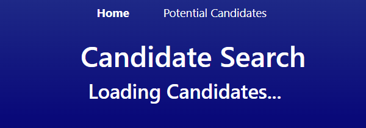
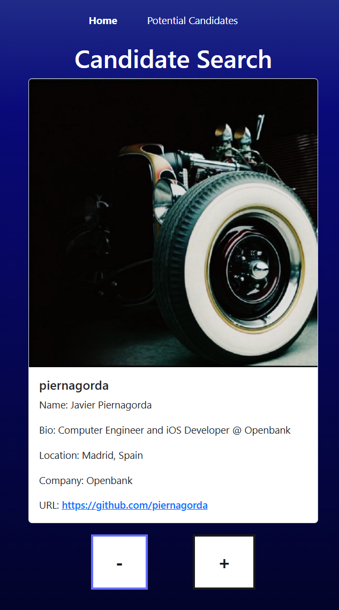
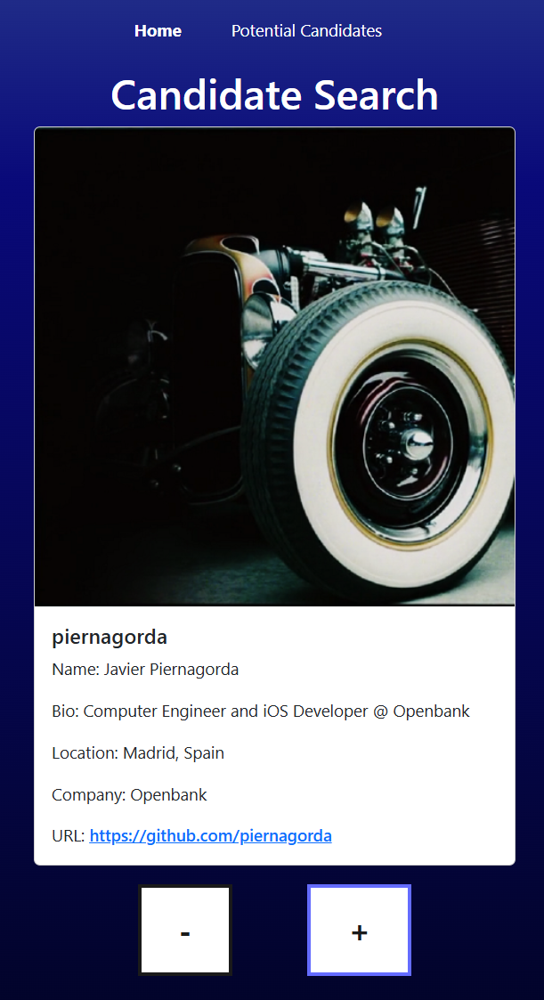
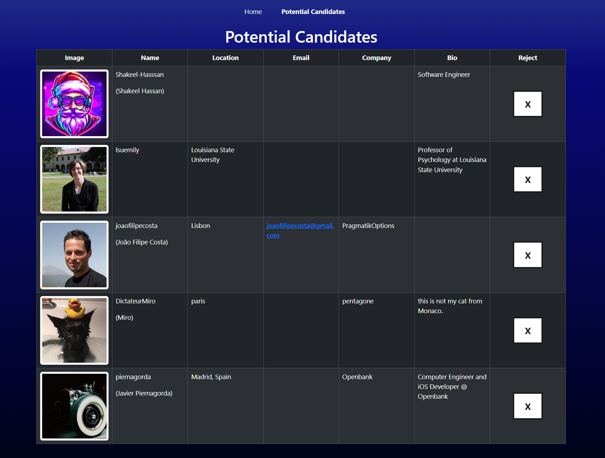
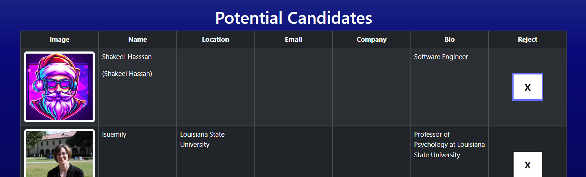
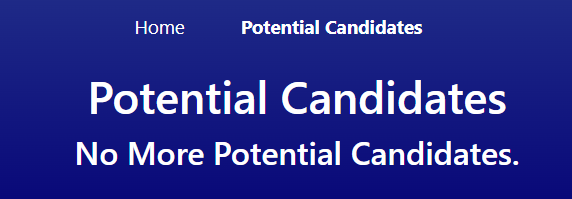

# Candidate Search
## Description:
Web application that uses the GitHub API to allow the user to browse GitHub profiles. The user can then save chosen profiles in persistent local storage.

This application was built to practice developing a Front-End with React and TypeScript.

## Table of Contents:
- [Technologies](#technologies)
- [Installation](#installation)
- [Usage](#usage)
- [Questions](#questions)

## Technologies:
- TypeScript
- React
- [Bootstrap](https://getbootstrap.com/)
- CSS
- [Netlify](https://render.com/)

## Installation:
View the deployed application at <https://candidate-search-app.netlify.app/>.

## Usage:
- When viewing the 'Home' page, wait for the candidates to load. This may take a few seconds.  

- When viewing a profile click the '-' button to view the next profile without saving the current profile.  

- Click the '+' button to save the current profile and then view the next profile.  

- Note: every once in awhile, the search will not return any profiles, but refreshing again should fix this. Otherwise, this message will only show up after going through every returned profile.  

- View currently saved profiles on the 'Potential Candidates' page.

- To remove a potential candidate from the table, click the 'X' button in the 'Reject' column.  

- If there are no potential candidates or all of them are removed, you will see the following screen.  

## Questions:
Contact me via github: [kayla-e774](https://github.com/kayla-e774)  
Or email me at: <kengelstad16@gmail.com>